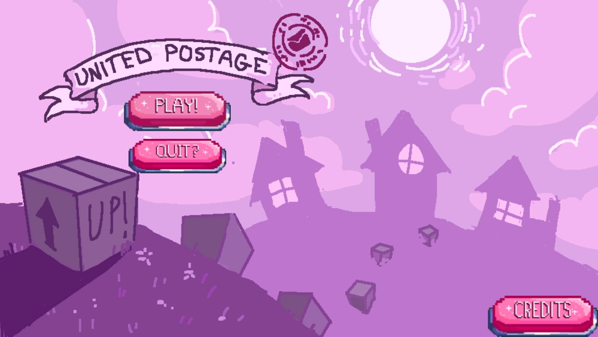
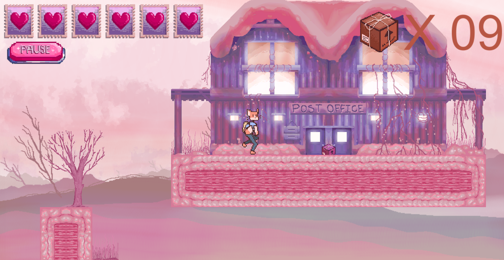
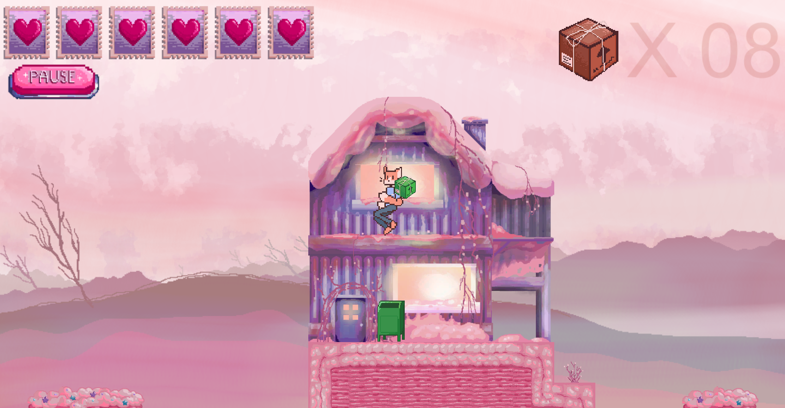
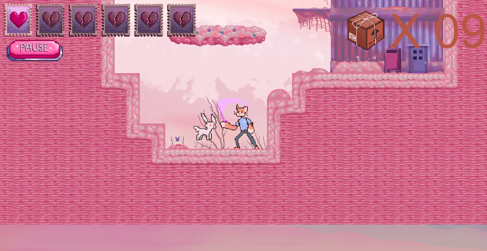
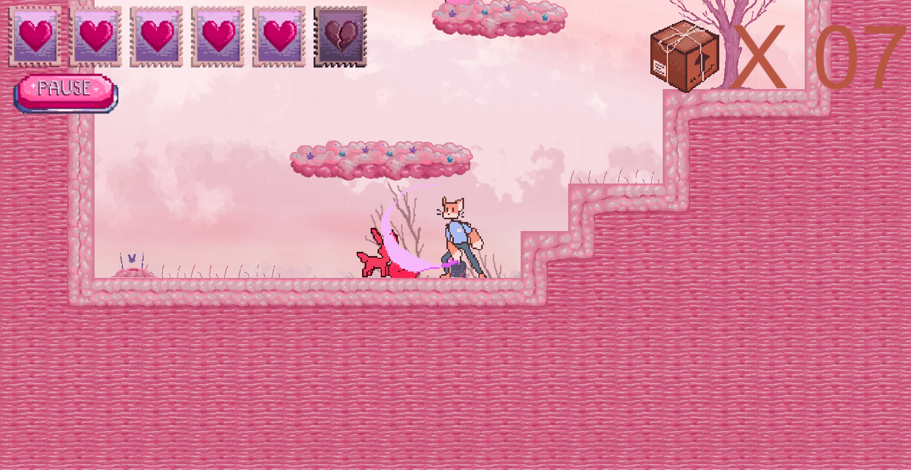

# UP!

UP! is a platforming game with the goal of delivering all the packages. The packages are dropped at the post office and the player has to deliver the packages to the mailboxes of the houses throughout the map.

UP! was developed using the Unity game engine. The game was developed over the course of three days for the [Mini Game Jam #11](https://itch.io/jam/mini-jame-gam-11). The team consisted of three programmers, four artists, and one sound designer. The game on GitHub is slightly different to the version that we submitted for the jam due to a few members of the team deciding to add polish and some bug fixes after the jam was over.

# UP! Windows Build

The project can be imported via Unity Hub into the Unity Editor version 2021.3.8f1

There is also a windows build for the game in build.zip

# Game Controls

* Spacebar - Jump
* A - Move left
* D - Move right
* Left Click - attack
* Right Click - pickup/drop package

# Game Screenshots

